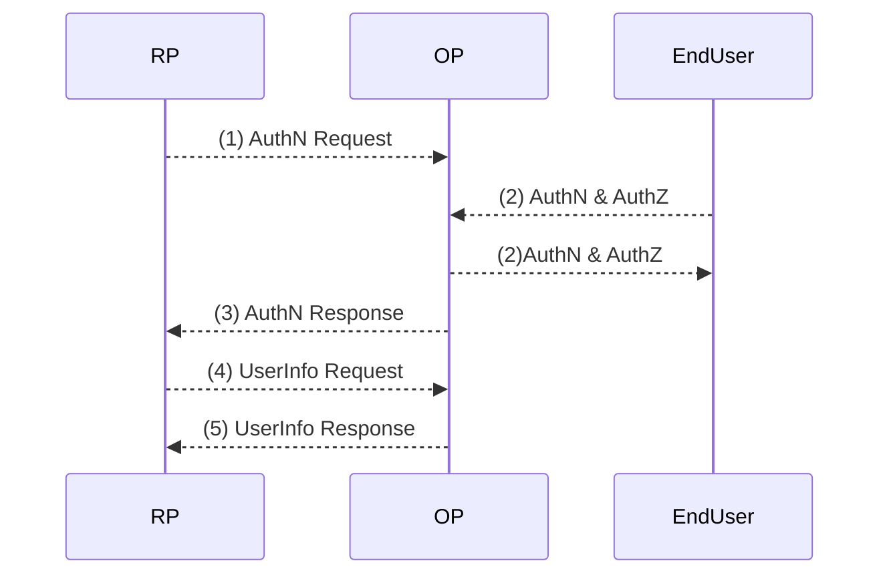

# OpenID Connect Core 1.0 incorporating errata set 1

## Abstract
OpenID Connect 1.0은 OAuth 2.0 프로토콜 위의 단순한 ID 레이어이다. 이를 통해 클라이언트는 권한 서버가 수행 한 인증을 기반으로 최종 사용자의 신원을 확인하고 최종 사용자에 대한 기본 프로파일 정보를 상호 운용 및 REST-like 방식으로 얻을 수 있습니다. 이 설명서의 핵심은 OpenID Connect 기능을 정의한다. OAuth 2.0을 기반으로 인증이 생성되고 최종 사용자에 대한 정보를 전달하기 위해 Claim을 사용한다. 또한 OpenID Connect 사용에 대한 보안 및 개인 정보 보호 고려 사항에 대해서도 설명한다.

## Table of Contents
	1.  Introduction
	    1.1.  Requirements Notation and Conventions
	    1.2.  Terminology
	    1.3.  Overview
	2.  ID Token
	3.  Authentication
	    3.1.  Authentication using the Authorization Code Flow
	        3.1.1.  Authorization Code Flow Steps
	        3.1.2.  Authorization Endpoint
	            3.1.2.1.  Authentication Request
	            3.1.2.2.  Authentication Request Validation
	            3.1.2.3.  Authorization Server Authenticates End-User
	            3.1.2.4.  Authorization Server Obtains End-User Consent/Authorization
	            3.1.2.5.  Successful Authentication Response
	            3.1.2.6.  Authentication Error Response
	            3.1.2.7.  Authentication Response Validation
	        3.1.3.  Token Endpoint
	            3.1.3.1.  Token Request
	            3.1.3.2.  Token Request Validation
	            3.1.3.3.  Successful Token Response
	            3.1.3.4.  Token Error Response
	            3.1.3.5.  Token Response Validation
	            3.1.3.6.  ID Token
	            3.1.3.7.  ID Token Validation
	            3.1.3.8.  Access Token Validation
	    3.2.  Authentication using the Implicit Flow
	        3.2.1.  Implicit Flow Steps
	        3.2.2.  Authorization Endpoint
	            3.2.2.1.  Authentication Request
	            3.2.2.2.  Authentication Request Validation
	            3.2.2.3.  Authorization Server Authenticates End-User
	            3.2.2.4.  Authorization Server Obtains End-User Consent/Authorization
	            3.2.2.5.  Successful Authentication Response
	            3.2.2.6.  Authentication Error Response
	            3.2.2.7.  Redirect URI Fragment Handling
	            3.2.2.8.  Authentication Response Validation
	            3.2.2.9.  Access Token Validation
	            3.2.2.10.  ID Token
	            3.2.2.11.  ID Token Validation
	    3.3.  Authentication using the Hybrid Flow
	        3.3.1.  Hybrid Flow Steps
	        3.3.2.  Authorization Endpoint
	            3.3.2.1.  Authentication Request
	            3.3.2.2.  Authentication Request Validation
	            3.3.2.3.  Authorization Server Authenticates End-User
	            3.3.2.4.  Authorization Server Obtains End-User Consent/Authorization
	            3.3.2.5.  Successful Authentication Response
	            3.3.2.6.  Authentication Error Response
	            3.3.2.7.  Redirect URI Fragment Handling
	            3.3.2.8.  Authentication Response Validation
	            3.3.2.9.  Access Token Validation
	            3.3.2.10.  Authorization Code Validation
	            3.3.2.11.  ID Token
	            3.3.2.12.  ID Token Validation
	        3.3.3.  Token Endpoint
	            3.3.3.1.  Token Request
	            3.3.3.2.  Token Request Validation
	            3.3.3.3.  Successful Token Response
	            3.3.3.4.  Token Error Response
	            3.3.3.5.  Token Response Validation
	            3.3.3.6.  ID Token
	            3.3.3.7.  ID Token Validation
	            3.3.3.8.  Access Token
	            3.3.3.9.  Access Token Validation
	4.  Initiating Login from a Third Party
	5.  Claims
	    5.1.  Standard Claims
	        5.1.1.  Address Claim
	        5.1.2.  Additional Claims
	    5.2.  Claims Languages and Scripts
	    5.3.  UserInfo Endpoint
	        5.3.1.  UserInfo Request
	        5.3.2.  Successful UserInfo Response
	        5.3.3.  UserInfo Error Response
	        5.3.4.  UserInfo Response Validation
	    5.4.  Requesting Claims using Scope Values
	    5.5.  Requesting Claims using the "claims" Request Parameter
	        5.5.1.  Individual Claims Requests
	            5.5.1.1.  Requesting the "acr" Claim
	        5.5.2.  Languages and Scripts for Individual Claims
	    5.6.  Claim Types
	        5.6.1.  Normal Claims
	        5.6.2.  Aggregated and Distributed Claims
	            5.6.2.1.  Example of Aggregated Claims
	            5.6.2.2.  Example of Distributed Claims
	    5.7.  Claim Stability and Uniqueness
	6.  Passing Request Parameters as JWTs
	    6.1.  Passing a Request Object by Value
	        6.1.1.  Request using the "request" Request Parameter
	    6.2.  Passing a Request Object by Reference
	        6.2.1.  URL Referencing the Request Object
	        6.2.2.  Request using the "request_uri" Request Parameter
	        6.2.3.  Authorization Server Fetches Request Object
	        6.2.4.  "request_uri" Rationale
	    6.3.  Validating JWT-Based Requests
	        6.3.1.  Encrypted Request Object
	        6.3.2.  Signed Request Object
	        6.3.3.  Request Parameter Assembly and Validation
	7.  Self-Issued OpenID Provider
	    7.1.  Self-Issued OpenID Provider Discovery
	    7.2.  Self-Issued OpenID Provider Registration
	        7.2.1.  Providing Information with the "registration" Request Parameter
	    7.3.  Self-Issued OpenID Provider Request
	    7.4.  Self-Issued OpenID Provider Response
	    7.5.  Self-Issued ID Token Validation
	8.  Subject Identifier Types
	    8.1.  Pairwise Identifier Algorithm
	9.  Client Authentication
	10.  Signatures and Encryption
	    10.1.  Signing
	        10.1.1.  Rotation of Asymmetric Signing Keys
	    10.2.  Encryption
	        10.2.1.  Rotation of Asymmetric Encryption Keys
	11.  Offline Access
	12.  Using Refresh Tokens
	    12.1.  Refresh Request
	    12.2.  Successful Refresh Response
	    12.3.  Refresh Error Response
	13.  Serializations
	    13.1.  Query String Serialization
	    13.2.  Form Serialization
	    13.3.  JSON Serialization
	14.  String Operations
	15.  Implementation Considerations
	    15.1.  Mandatory to Implement Features for All OpenID Providers
	    15.2.  Mandatory to Implement Features for Dynamic OpenID Providers
	    15.3.  Discovery and Registration
	    15.4.  Mandatory to Implement Features for Relying Parties
	    15.5.  Implementation Notes
	        15.5.1.  Authorization Code Implementation Notes
	        15.5.2.  Nonce Implementation Notes
	        15.5.3.  Redirect URI Fragment Handling Implementation Notes
	    15.6.  Compatibility Notes
	        15.6.1.  Pre-Final IETF Specifications
	        15.6.2.  Google "iss" Value
	    15.7.  Related Specifications and Implementer's Guides
	16.  Security Considerations
	    16.1.  Request Disclosure
	    16.2.  Server Masquerading
	    16.3.  Token Manufacture/Modification
	    16.4.  Access Token Disclosure
	    16.5.  Server Response Disclosure
	    16.6.  Server Response Repudiation
	    16.7.  Request Repudiation
	    16.8.  Access Token Redirect
	    16.9.  Token Reuse
	    16.10.  Eavesdropping or Leaking Authorization Codes (Secondary Authenticator Capture)
	    16.11.  Token Substitution
	    16.12.  Timing Attack
	    16.13.  Other Crypto Related Attacks
	    16.14.  Signing and Encryption Order
	    16.15.  Issuer Identifier
	    16.16.  Implicit Flow Threats
	    16.17.  TLS Requirements
	    16.18.  Lifetimes of Access Tokens and Refresh Tokens
	    16.19.  Symmetric Key Entropy
	    16.20.  Need for Signed Requests
	    16.21.  Need for Encrypted Requests
	17.  Privacy Considerations
	    17.1.  Personally Identifiable Information
	    17.2.  Data Access Monitoring
	    17.3.  Correlation
	    17.4.  Offline Access
	18.  IANA Considerations
	    18.1.  JSON Web Token Claims Registration
	        18.1.1.  Registry Contents
	    18.2.  OAuth Parameters Registration
	        18.2.1.  Registry Contents
	    18.3.  OAuth Extensions Error Registration
	        18.3.1.  Registry Contents
	19.  References
	    19.1.  Normative References
	    19.2.  Informative References
	Appendix A.  Authorization Examples
	    A.1.  Example using response_type=code
	    A.2.  Example using response_type=id_token
	    A.3.  Example using response_type=id_token token
	    A.4.  Example using response_type=code id_token
	    A.5.  Example using response_type=code token
	    A.6.  Example using response_type=code id_token token
	    A.7.  RSA Key Used in Examples
	Appendix B.  Acknowledgements
	Appendix C.  Notices
	§  Authors' Addresses

## 1. Introduction
 OpenID Connect 1.0은 OAuth 2.0 프로토콜 위의 단순한 ID 레이어이다. 이를 통해 클라이언트는 권한 서버가 수행 한 인증을 기반으로 최종 사용자의 신원을 확인하고 최종 사용자에 대한 기본 프로파일 정보를 상호 운용 및 REST-like 방식으로 얻을 수 있습니다.

 이 설명서의 핵심은 OpenID Connect 기능을 정의한다. OAuth 2.0을 기반으로 인증이 생성되고 최종 사용자에 대한 정보를 전달하기 위해 Claim을 사용한다. 또한 OpenID Connect 사용에 대한 보안 및 개인 정보 보호 고려 사항에 대해서도 설명한다.

OAuth 2.0 **Authorization Framework**와 **OAuth 2.0 Bearer Token Usage** 설명서는 타사 응용 프로그램이 HTTP 자원에 대한 제한덴 액세스 권한을 얻고 사용할 수 있는 일반적인 프레임 워크를 제공한다. 이는 Access Token을 얻어서 리소스에 접근하는 메커니즘을 정의하지만 ID 정보를 제공하기위한 표준 방법을 정의하지는 않는다. 특히, OAuth 2.0 프로파일링 없이는 최종 사용자의 인증에 대한 정보를 제공 할 수 없다. 독자는이 사양에 익숙해야져야 한다.

OpenID Connect는 OAuth 2.0 인증 프로세스의 확장으로서 인증을 구현한다. 이 확장의 사용은 권한 요청에 openid 범위 값을 포함하여 클라이언트가 요청한다.

수행 된 인증에 대한 정보는 ID 토큰이라는 JSON Web Token (JWT)(2 절 참조)에 반환된다. OpenID Connect를 구현하는 OAuth 2.0 인증 서버는 OpenID Providers (OP)라고도한다. OAuth 2.0 OpenID Connect를 사용하는 클라이언트는 RP (Relying Parties)라고도 한다.

## 1.2. Terminology
	This specification also defines the following terms:
	Authentication
		Process used to achieve sufficient confidence in the binding between the Entity and the presented Identity.
Authentication Request
OAuth 2.0 Authorization Request using extension parameters and scopes defined by OpenID Connect to request that the End-User be authenticated by the Authorization Server, which is an OpenID Connect Provider, to the Client, which is an OpenID Connect Relying Party.
Authentication Context
Information that the Relying Party can require before it makes an entitlement decision with respect to an authentication response. Such context can include, but is not limited to, the actual authentication method used or level of assurance such as ISO/IEC 29115 [ISO29115] entity authentication assurance level.
Authentication Context Class
Set of authentication methods or procedures that are considered to be equivalent to each other in a particular context.
Authentication Context Class Reference
Identifier for an Authentication Context Class.
Authorization Code Flow
OAuth 2.0 flow in which an Authorization Code is returned from the Authorization Endpoint and all tokens are returned from the Token Endpoint.
Authorization Request
OAuth 2.0 Authorization Request as defined by [RFC6749].
Claim
Piece of information asserted about an Entity.
Claim Type
Syntax used for representing a Claim Value. This specification defines Normal, Aggregated, and Distributed Claim Types.
Claims Provider
Server that can return Claims about an Entity.
Credential
Data presented as evidence of the right to use an identity or other resources.
End-User
Human participant.
Entity
Something that has a separate and distinct existence and that can be identified in a context. An End-User is one example of an Entity.
Essential Claim
Claim specified by the Client as being necessary to ensure a smooth authorization experience for the specific task requested by the End-User.
Hybrid Flow
OAuth 2.0 flow in which an Authorization Code is returned from the Authorization Endpoint, some tokens are returned from the Authorization Endpoint, and others are returned from the Token Endpoint.
ID Token
JSON Web Token (JWT) [JWT] that contains Claims about the Authentication event. It MAY contain other Claims.
Identifier
Value that uniquely characterizes an Entity in a specific context.
Identity
Set of attributes related to an Entity.
Implicit Flow
OAuth 2.0 flow in which all tokens are returned from the Authorization Endpoint and neither the Token Endpoint nor an Authorization Code are used.
Issuer
Entity that issues a set of Claims.
Issuer Identifier
Verifiable Identifier for an Issuer. An Issuer Identifier is a case sensitive URL using the https scheme that contains scheme, host, and optionally, port number and path components and no query or fragment components.
Message
Request or a response between an OpenID Relying Party and an OpenID Provider.
OpenID Provider (OP)
OAuth 2.0 Authorization Server that is capable of Authenticating the End-User and providing Claims to a Relying Party about the Authentication event and the End-User.
Request Object
JWT that contains a set of request parameters as its Claims.
Request URI
URL that references a resource containing a Request Object. The Request URI contents MUST be retrievable by the Authorization Server.
Pairwise Pseudonymous Identifier (PPID)
Identifier that identifies the Entity to a Relying Party that cannot be correlated with the Entity's PPID at another Relying Party.
Personally Identifiable Information (PII)
Information that (a) can be used to identify the natural person to whom such information relates, or (b) is or might be directly or indirectly linked to a natural person to whom such information relates.
Relying Party (RP)
OAuth 2.0 Client application requiring End-User Authentication and Claims from an OpenID Provider.
Sector Identifier
Host component of a URL used by the Relying Party's organization that is an input to the computation of pairwise Subject Identifiers for that Relying Party.
Self-Issued OpenID Provider
Personal, self-hosted OpenID Provider that issues self-signed ID Tokens.
Subject Identifier
Locally unique and never reassigned identifier within the Issuer for the End-User, which is intended to be consumed by the Client.
UserInfo Endpoint
Protected Resource that, when presented with an Access Token by the Client, returns authorized information about the End-User represented by the corresponding Authorization Grant. The UserInfo Endpoint URL MUST use the https scheme and MAY contain port, path, and query parameter components.
Validation
Process intended to establish the soundness or correctness of a construct.
Verification
Process intended to test or prove the truth or accuracy of a fact or value.
Voluntary Claim
Claim specified by the Client as being useful but not Essential for the specific task requested by the End-User.
IMPORTANT NOTE TO READERS: The terminology definitions in this section are a normative portion of this specification, imposing requirements upon implementations. All the capitalized words in the text of this specification, such as "Issuer Identifier", reference these defined terms. Whenever the reader encounters them, their definitions found in this section must be followed.

For more background on some of the terminology used, see Internet Security Glossary, Version 2 [RFC4949], ISO/IEC 29115 Entity Authentication Assurance [ISO29115], and ITU-T X.1252

## 1.1. Requirements Notation and Coventions

<!--stackedit_data:
eyJoaXN0b3J5IjpbLTk0MTM4MjY1MV19
-->